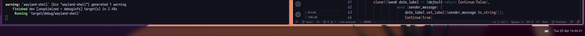

This is my first attempt with gtk, so the code "may" not look pretty. However, I plan to rewrite it once I gain more knowledge about gtk. At present, the code only displays a basic bar indicating the date and battery level.



You currently need to compile https://github.com/wmww/gtk4-layer-shell yourself to run this project.

```bash
export PKG_CONFIG_PATH=/usr/local/lib/pkgconfig
export LD_LIBRARY_PATH=/usr/local/lib
cargo run 
```


# roadmap / todo

- [ ] current window name
- [ ] current workspace (hyprland, others(?))
- [ ] notifications
- [ ] programm launcher (.desktop files) 
- [ ] modularity (only needed if other people want to use this wacky projekt haha)